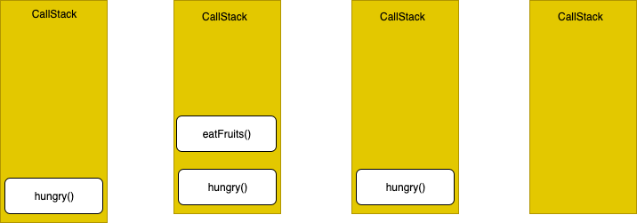

### Table of Contents

| No. | Questions                                                                                                                                                         |
| --- | ----------------------------------------------------------------------------------------------------------------------------------------------------------------- |

| 191 | [What is the purpose of using object is method](#what-is-the-purpose-of-using-object-is-method)                                                                   |
| 192 | [How do you copy properties from one object to other](#how-do-you-copy-properties-from-one-object-to-other)                                                       |
| 193 | [What are the applications of assign method](#what-are-the-applications-of-assign-method)                                                                         |
| 194 | [What is a proxy object](#what-is-a-proxy-object)                                                                                                                 |
| 195 | [What is the purpose of seal method](#what-is-the-purpose-of-seal-method)                                                                                         |
| 196 | [What are the applications of seal method](#what-are-the-applications-of-seal-method)                                                                             |
| 197 | [What are the differences between freeze and seal methods](#what-are-the-differences-between-freeze-and-seal-methods)                                             |
| 198 | [How do you determine if an object is sealed or not](#how-do-you-determine-if-an-object-is-sealed-or-not)                                                         |
| 199 | [How do you get enumerable key and value pairs](#how-do-you-get-enumerable-key-and-value-pairs)                                                                   |
| 200 | [What is the main difference between Object.values and Object.entries method](#what-is-the-main-difference-between-objectvalues-and-objectentries-method)       |
| 201 | [How can you get the list of keys of any object](#how-can-you-get-the-list-of-keys-of-any-object)                                                                 |
| 202 | [How do you create an object with prototype](#how-do-you-create-an-object-with-prototype)                                                                         |
| 203 | [What is a WeakSet](#what-is-a-weakset)                                                                                                                           |
| 204 | [What are the differences between WeakSet and Set](#what-are-the-differences-between-weakset-and-set)                                                             |
| 205 | [List down the collection of methods available on WeakSet](#list-down-the-collection-of-methods-available-on-weakset)                                             |
| 206 | [What is a WeakMap](#what-is-a-weakmap)                                                                                                                           |
| 207 | [What are the differences between WeakMap and Map](#what-are-the-differences-between-weakmap-and-map)                                                             |
| 208 | [List down the collection of methods available on WeakMap](#list-down-the-collection-of-methods-available-on-weakmap)                                             |
| 209 | [What is the purpose of uneval](#what-is-the-purpose-of-uneval)                                                                                                   |
| 210 | [How do you encode an URL](#how-do-you-encode-an-url)                                                                                                             |
| 211 | [How do you decode an URL](#how-do-you-decode-an-url)                                                                                                             |
| 212 | [How do you print the contents of web page](#how-do-you-print-the-contents-of-web-page)                                                                           |
| 213 | [What is the difference between uneval and eval](#what-is-the-difference-between-uneval-and-eval)                                                                 |
| 214 | [What is an anonymous function](#what-is-an-anonymous-function)                                                                                                   |
| 215 | [What is the precedence order between local and global variables](#what-is-the-precedence-order-between-local-and-global-variables)                               |
| 216 | [What are javascript accessors](#what-are-javascript-accessors)                                                                                                   |
| 217 | [How do you define property on Object constructor](#how-do-you-define-property-on-object-constructor)                                                             |
| 218 | [What is the difference between get and defineProperty](#what-is-the-difference-between-get-and-defineproperty)                                                   |
| 219 | [What are the advantages of Getters and Setters](#what-are-the-advantages-of-getters-and-setters)                                                                 |
| 220 | [Can I add getters and setters using defineProperty method](#can-i-add-getters-and-setters-using-defineproperty-method)                                           |
| 221 | [What is the purpose of switch-case](#what-is-the-purpose-of-switch-case)                                                                                         |
| 222 | [What are the conventions to be followed for the usage of switch case](#what-are-the-conventions-to-be-followed-for-the-usage-of-switch-case)                     |
| 223 | [What are primitive data types](#what-are-primitive-data-types)                                                                                                   |
| 224 | [What are the different ways to access object properties](#what-are-the-different-ways-to-access-object-properties)                                               |
| 225 | [What are the function parameter rules](#what-are-the-function-parameter-rules)                                                                                   |
| 226 | [What is an error object](#what-is-an-error-object)                                                                                                               |
| 227 | [When you get a syntax error](#when-you-get-a-syntax-error)                                                                                                       |
| 228 | [What are the different error names from error object](#what-are-the-different-error-names-from-error-object)                                                     |
| 229 | [What are the various statements in error handling](#what-are-the-various-statements-in-error-handling)                                                           |
| 230 | [What are the two types of loops in javascript](#what-are-the-two-types-of-loops-in-javascript)                                                                   |
| 231 | [What is nodejs](#what-is-nodejs)                                                                                                                                 |
| 232 | [What is an Intl object](#what-is-an-intl-object)                                                                                                                 |
| 233 | [How do you perform language specific date and time formatting](#how-do-you-perform-language-specific-date-and-time-formatting)                                   |
| 234 | [What is an Iterator](#what-is-an-iterator)                                                                                                                       |
| 235 | [How does synchronous iteration works](#how-does-synchronous-iteration-works)                                                                                     |
| 236 | [What is an event loop](#what-is-an-event-loop)                                                                                                                   |
| 237 | [What is call stack](#what-is-call-stack)                                                                                                                         |
| 238 | [What is an event queue](#what-is-an-event-queue)                                                                                                                 |
| 239 | [What is a decorator](#what-is-a-decorator)                                                                                                                       |
| 240 | [What are the properties of Intl object](#what-are-the-properties-of-intl-object)                                                                                 |

191. ### What is the purpose of using object is method

     Some of the applications of Object's `is` method are follows,

     1. It is used for comparison of two strings.
     2. It is used for comparison of two numbers.
     3. It is used for comparing the polarity of two numbers.
     4. It is used for comparison of two objects.

     **[⬆ Back to Top](#table-of-contents)**

192. ### How do you copy properties from one object to other

     You can use the Object.assign() method which is used to copy the values and properties from one or more source objects to a target object. It returns the target object which has properties and values copied from the source objects. The syntax would be as below,

     ```javascript
     Object.assign(target, ...sources);
     ```

     Let's take example with one source and one target object,

     ```javascript
     const target = { a: 1, b: 2 };
     const source = { b: 3, c: 4 };

     const returnedTarget = Object.assign(target, source);

     console.log(target); // { a: 1, b: 3, c: 4 }

     console.log(returnedTarget); // { a: 1, b: 3, c: 4 }
     ```

     As observed in the above code, there is a common property(`b`) from source to target so it's value has been overwritten.

     **[⬆ Back to Top](#table-of-contents)**

193. ### What are the applications of assign method

     Below are the some of main applications of Object.assign() method,

     1. It is used for cloning an object.
     2. It is used to merge objects with the same properties.

     **[⬆ Back to Top](#table-of-contents)**

194. ### What is a proxy object

     The Proxy object is used to define custom behavior for fundamental operations such as property lookup, assignment, enumeration, function invocation, etc. The syntax would be as follows,

     ```javascript
     var p = new Proxy(target, handler);
     ```

     Let's take an example of proxy object,

     ```javascript
     var handler = {
       get: function (obj, prop) {
         return prop in obj ? obj[prop] : 100;
       },
     };

     var p = new Proxy({}, handler);
     p.a = 10;
     p.b = null;

     console.log(p.a, p.b); // 10, null
     console.log("c" in p, p.c); // false, 100
     ```

     In the above code, it uses `get` handler which define the behavior of the proxy when an operation is performed on it

     **[⬆ Back to Top](#table-of-contents)**

195. ### What is the purpose of seal method

     The **Object.seal()** method is used to seal an object, by preventing new properties from being added to it and marking all existing properties as non-configurable. But values of present properties can still be changed as long as they are writable. Let's see the below example to understand more about seal() method

     ```javascript
     const object = {
       property: "Welcome JS world",
     };
     Object.seal(object);
     object.property = "Welcome to object world";
     console.log(Object.isSealed(object)); // true
     delete object.property; // You cannot delete when sealed
     console.log(object.property); //Welcome to object world
     ```

     **[⬆ Back to Top](#table-of-contents)**

196. ### What are the applications of seal method

     Below are the main applications of Object.seal() method,

     1. It is used for sealing objects and arrays.
     2. It is used to make an object immutable.

     **[⬆ Back to Top](#table-of-contents)**

197. ### What are the differences between freeze and seal methods

     If an object is frozen using the Object.freeze() method then its properties become immutable and no changes can be made in them whereas if an object is sealed using the Object.seal() method then the changes can be made in the existing properties of the object.

     **[⬆ Back to Top](#table-of-contents)**

198. ### How do you determine if an object is sealed or not

     The Object.isSealed() method is used to determine if an object is sealed or not. An object is sealed if all of the below conditions hold true

     1. If it is not extensible.
     2. If all of its properties are non-configurable.
     3. If it is not removable (but not necessarily non-writable).
        Let's see it in the action

     ```javascript
     const object = {
       property: "Hello, Good morning",
     };

     Object.seal(object); // Using seal() method to seal the object

     console.log(Object.isSealed(object)); // checking whether the object is sealed or not
     ```

     **[⬆ Back to Top](#table-of-contents)**

199. ### How do you get enumerable key and value pairs

     The Object.entries() method is used to return an array of a given object's own enumerable string-keyed property [key, value] pairs, in the same order as that provided by a for...in loop. Let's see the functionality of object.entries() method in an example,

     ```javascript
     const object = {
       a: "Good morning",
       b: 100,
     };

     for (let [key, value] of Object.entries(object)) {
       console.log(`${key}: ${value}`); // a: 'Good morning'
       // b: 100
     }
     ```

     **Note:** The order is not guaranteed as object defined.

     **[⬆ Back to Top](#table-of-contents)**

200. ### What is the main difference between Object.values and Object.entries method

     The Object.values() method's behavior is similar to Object.entries() method but it returns an array of values instead [key,value] pairs.

     ```javascript
     const object = {
       a: "Good morning",
       b: 100,
     };

     for (let value of Object.values(object)) {
       console.log(`${value}`); // 'Good morning'
       100;
     }
     ```

     **[⬆ Back to Top](#table-of-contents)**

201. ### How can you get the list of keys of any object

     You can use the `Object.keys()` method which is used to return an array of a given object's own property names, in the same order as we get with a normal loop. For example, you can get the keys of a user object,

     ```javascript
     const user = {
       name: "John",
       gender: "male",
       age: 40,
     };

     console.log(Object.keys(user)); //['name', 'gender', 'age']
     ```

     **[⬆ Back to Top](#table-of-contents)**

202. ### How do you create an object with prototype

     The Object.create() method is used to create a new object with the specified prototype object and properties. i.e, It uses an existing object as the prototype of the newly created object. It returns a new object with the specified prototype object and properties.

     ```javascript
     const user = {
       name: "John",
       printInfo: function () {
         console.log(`My name is ${this.name}.`);
       },
     };

     const admin = Object.create(user);

     admin.name = "Nick"; // Remember that "name" is a property set on "admin" but not on "user" object

     admin.printInfo(); // My name is Nick
     ```

     **[⬆ Back to Top](#table-of-contents)**

203. ### What is a WeakSet

     WeakSet is used to store a collection of weakly(weak references) held objects. The syntax would be as follows,

     ```javascript
     new WeakSet([iterable]);
     ```

     Let's see the below example to explain it's behavior,

     ```javascript
     var ws = new WeakSet();
     var user = {};
     ws.add(user);
     ws.has(user); // true
     ws.delete(user); // removes user from the set
     ws.has(user); // false, user has been removed
     ```

     **[⬆ Back to Top](#table-of-contents)**

204. ### What are the differences between WeakSet and Set

     The main difference is that references to objects in Set are strong while references to objects in WeakSet are weak. i.e, An object in WeakSet can be garbage collected if there is no other reference to it.
     Other differences are,

     1. Sets can store any value Whereas WeakSets can store only collections of objects
     2. WeakSet does not have size property unlike Set
     3. WeakSet does not have methods such as clear, keys, values, entries, forEach.
     4. WeakSet is not iterable.

     **[⬆ Back to Top](#table-of-contents)**

205. ### List down the collection of methods available on WeakSet

     Below are the list of methods available on WeakSet,

     1. add(value): A new object is appended with the given value to the weakset
     2. delete(value): Deletes the value from the WeakSet collection.
     3. has(value): It returns true if the value is present in the WeakSet Collection, otherwise it returns false.

     Let's see the functionality of all the above methods in an example,

     ```javascript
     var weakSetObject = new WeakSet();
     var firstObject = {};
     var secondObject = {};
     // add(value)
     weakSetObject.add(firstObject);
     weakSetObject.add(secondObject);
     console.log(weakSetObject.has(firstObject)); //true
     weakSetObject.delete(secondObject);
     ```

     **[⬆ Back to Top](#table-of-contents)**

206. ### What is a WeakMap

     The WeakMap object is a collection of key/value pairs in which the keys are weakly referenced. In this case, keys must be objects and the values can be arbitrary values. The syntax is looking like as below,

     ```javascript
     new WeakMap([iterable]);
     ```

     Let's see the below example to explain it's behavior,

     ```javascript
     var ws = new WeakMap();
     var user = {};
     ws.set(user);
     ws.has(user); // true
     ws.delete(user); // removes user from the map
     ws.has(user); // false, user has been removed
     ```

     **[⬆ Back to Top](#table-of-contents)**

207. ### What are the differences between WeakMap and Map

     The main difference is that references to key objects in Map are strong while references to key objects in WeakMap are weak. i.e, A key object in WeakMap can be garbage collected if there is no other reference to it.
     Other differences are,

     1. Maps can store any key type Whereas WeakMaps can store only collections of key objects
     2. WeakMap does not have size property unlike Map
     3. WeakMap does not have methods such as clear, keys, values, entries, forEach.
     4. WeakMap is not iterable.

     **[⬆ Back to Top](#table-of-contents)**

208. ### List down the collection of methods available on WeakMap

     Below are the list of methods available on WeakMap,

     1. set(key, value): Sets the value for the key in the WeakMap object. Returns the WeakMap object.
     2. delete(key): Removes any value associated to the key.
     3. has(key): Returns a Boolean asserting whether a value has been associated to the key in the WeakMap object or not.
     4. get(key): Returns the value associated to the key, or undefined if there is none.
        Let's see the functionality of all the above methods in an example,

     ```javascript
     var weakMapObject = new WeakMap();
     var firstObject = {};
     var secondObject = {};
     // set(key, value)
     weakMapObject.set(firstObject, "John");
     weakMapObject.set(secondObject, 100);
     console.log(weakMapObject.has(firstObject)); //true
     console.log(weakMapObject.get(firstObject)); // John
     weakMapObject.delete(secondObject);
     ```

     **[⬆ Back to Top](#table-of-contents)**

209. ### What is the purpose of uneval

     The uneval() is an inbuilt function which is used to create a string representation of the source code of an Object. It is a top-level function and is not associated with any object. Let's see the below example to know more about it's functionality,

     ```javascript
     var a = 1;
     uneval(a); // returns a String containing 1
     uneval(function user() {}); // returns "(function user(){})"
     ```

     **[⬆ Back to Top](#table-of-contents)**

210. ### How do you encode an URL

     The encodeURI() function is used to encode complete URI which has special characters except (, / ? : @ & = + $ #) characters.

     ```javascript
     var uri = "https://mozilla.org/?x=шеллы";
     var encoded = encodeURI(uri);
     console.log(encoded); // https://mozilla.org/?x=%D1%88%D0%B5%D0%BB%D0%BB%D1%8B
     ```

     **[⬆ Back to Top](#table-of-contents)**

211. ### How do you decode an URL

     The decodeURI() function is used to decode a Uniform Resource Identifier (URI) previously created by encodeURI().

     ```javascript
     var uri = "https://mozilla.org/?x=шеллы";
     var encoded = encodeURI(uri);
     console.log(encoded); // https://mozilla.org/?x=%D1%88%D0%B5%D0%BB%D0%BB%D1%8B
     try {
       console.log(decodeURI(encoded)); // "https://mozilla.org/?x=шеллы"
     } catch (e) {
       // catches a malformed URI
       console.error(e);
     }
     ```

     **[⬆ Back to Top](#table-of-contents)**

212. ### How do you print the contents of web page

     The window object provided a print() method which is used to print the contents of the current window. It opens a Print dialog box which lets you choose between various printing options. Let's see the usage of print method in an example,

     ```html
     <input type="button" value="Print" onclick="window.print()" />
     ```

     **Note:** In most browsers, it will block while the print dialog is open.

     **[⬆ Back to Top](#table-of-contents)**

213. ### What is the difference between uneval and eval

     The `uneval` function returns the source of a given object; whereas the `eval` function does the opposite, by evaluating that source code in a different memory area. Let's see an example to clarify the difference,

     ```javascript
     var msg = uneval(function greeting() {
       return "Hello, Good morning";
     });
     var greeting = eval(msg);
     greeting(); // returns "Hello, Good morning"
     ```

     **[⬆ Back to Top](#table-of-contents)**

214. ### What is an anonymous function

     An anonymous function is a function without a name! Anonymous functions are commonly assigned to a variable name or used as a callback function. The syntax would be as below,

     ```javascript
     function (optionalParameters) {
       //do something
     }

     const myFunction = function(){ //Anonymous function assigned to a variable
       //do something
     };

     [1, 2, 3].map(function(element){ //Anonymous function used as a callback function
       //do something
     });
     ```

     Let's see the above anonymous function in an example,

     ```javascript
     var x = function (a, b) {
       return a * b;
     };
     var z = x(5, 10);
     console.log(z); // 50
     ```

     **[⬆ Back to Top](#table-of-contents)**

215. ### What is the precedence order between local and global variables

     A local variable takes precedence over a global variable with the same name. Let's see this behavior in an example.

     ```javascript
     var msg = "Good morning";
     function greeting() {
       msg = "Good Evening";
       console.log(msg); // Good Evening
     }
     greeting();
     ```

     **[⬆ Back to Top](#table-of-contents)**

216. ### What are javascript accessors

     ECMAScript 5 introduced javascript object accessors or computed properties through getters and setters. Getters uses the `get` keyword whereas Setters uses the `set` keyword.

     ```javascript
     var user = {
       firstName: "John",
       lastName : "Abraham",
       language : "en",
       get lang() {
         return this.language;
       },
       set lang(lang) {
       this.language = lang;
       }
     };
     console.log(user.lang); // getter access lang as en
     user.lang = 'fr';
     console.log(user.lang); // setter used to set lang as fr
     ```

     **[⬆ Back to Top](#table-of-contents)**

217. ### How do you define property on Object constructor

     The Object.defineProperty() static method is used to define a new property directly on an object, or modify an existing property on an object, and returns the object. Let's see an example to know how to define property,

     ```javascript
     const newObject = {};

     Object.defineProperty(newObject, "newProperty", {
       value: 100,
       writable: false,
     });

     console.log(newObject.newProperty); // 100

     newObject.newProperty = 200; // It throws an error in strict mode due to writable setting
     ```

     **[⬆ Back to Top](#table-of-contents)**

218. ### What is the difference between get and defineProperty

     Both have similar results until unless you use classes. If you use `get` the property will be defined on the prototype of the object whereas using `Object.defineProperty()` the property will be defined on the instance it is applied to.

     **[⬆ Back to Top](#table-of-contents)**

219. ### What are the advantages of Getters and Setters

     Below are the list of benefits of Getters and Setters,

     1. They provide simpler syntax
     2. They are used for defining computed properties, or accessors in JS.
     3. Useful to provide equivalence relation between properties and methods
     4. They can provide better data quality
     5. Useful for doing things behind the scenes with the encapsulated logic.

     **[⬆ Back to Top](#table-of-contents)**

220. ### Can I add getters and setters using defineProperty method

     Yes, You can use the `Object.defineProperty()` method to add Getters and Setters. For example, the below counter object uses increment, decrement, add and subtract properties,

     ```javascript
     var obj = { counter: 0 };

     // Define getters
     Object.defineProperty(obj, "increment", {
       get: function () {
         this.counter++;
       },
     });
     Object.defineProperty(obj, "decrement", {
       get: function () {
         this.counter--;
       },
     });

     // Define setters
     Object.defineProperty(obj, "add", {
       set: function (value) {
         this.counter += value;
       },
     });
     Object.defineProperty(obj, "subtract", {
       set: function (value) {
         this.counter -= value;
       },
     });

     obj.add = 10;
     obj.subtract = 5;
     console.log(obj.increment); //6
     console.log(obj.decrement); //5
     ```

     **[⬆ Back to Top](#table-of-contents)**

221. ### What is the purpose of switch-case

     The switch case statement in JavaScript is used for decision making purposes. In a few cases, using the switch case statement is going to be more convenient than if-else statements. The syntax would be as below,

     ```javascript
     switch (expression)
     {
         case value1:
             statement1;
             break;
         case value2:
             statement2;
             break;
         .
         .
         case valueN:
             statementN;
             break;
         default:
             statementDefault;
     }
     ```

     The above multi-way branch statement provides an easy way to dispatch execution to different parts of code based on the value of the expression.

     **[⬆ Back to Top](#table-of-contents)**

222. ### What are the conventions to be followed for the usage of switch case

     Below are the list of conventions should be taken care,

     1. The expression can be of type either number or string.
     2. Duplicate values are not allowed for the expression.
     3. The default statement is optional. If the expression passed to switch does not match with any case value then the statement within default case will be executed.
     4. The break statement is used inside the switch to terminate a statement sequence.
     5. The break statement is optional. But if it is omitted, the execution will continue on into the next case.

     **[⬆ Back to Top](#table-of-contents)**

223. ### What are primitive data types

     A primitive data type is data that has a primitive value (which has no properties or methods). There are 7 types of primitive data types.

     1. string
     2. number
     3. boolean
     4. null
     5. undefined
     6. bigint
     7. symbol

     **[⬆ Back to Top](#table-of-contents)**

224. ### What are the different ways to access object properties

     There are 3 possible ways for accessing the property of an object.

     1. **Dot notation:** It uses dot for accessing the properties

     ```javascript
     objectName.property;
     ```

     1. **Square brackets notation:** It uses square brackets for property access

     ```javascript
     objectName["property"];
     ```

     1. **Expression notation:** It uses expression in the square brackets

     ```javascript
     objectName[expression];
     ```

     **[⬆ Back to Top](#table-of-contents)**

225. ### What are the function parameter rules

     JavaScript functions follow below rules for parameters,

     1. The function definitions do not specify data types for parameters.
     2. Do not perform type checking on the passed arguments.
     3. Do not check the number of arguments received.
        i.e, The below function follows the above rules,

     ```javascript
     function functionName(parameter1, parameter2, parameter3) {
       console.log(parameter1); // 1
     }
     functionName(1);
     ```

     **[⬆ Back to Top](#table-of-contents)**

226. ### What is an error object

     An error object is a built in error object that provides error information when an error occurs. It has two properties: name and message. For example, the below function logs error details,

     ```javascript
     try {
       greeting("Welcome");
     } catch (err) {
       console.log(err.name + "<br>" + err.message);
     }
     ```

     **[⬆ Back to Top](#table-of-contents)**

227. ### When you get a syntax error

     A SyntaxError is thrown if you try to evaluate code with a syntax error. For example, the below missing quote for the function parameter throws a syntax error

     ```javascript
     try {
       eval("greeting('welcome)"); // Missing ' will produce an error
     } catch (err) {
       console.log(err.name);
     }
     ```

     **[⬆ Back to Top](#table-of-contents)**

228. ### What are the different error names from error object

     There are 6 different types of error names returned from error object,
     | Error Name | Description |
     |---- | ---------
     | EvalError | An error has occurred in the eval() function |
     | RangeError | An error has occurred with a number "out of range" |
     | ReferenceError | An error due to an illegal reference|
     | SyntaxError | An error due to a syntax error|
     | TypeError | An error due to a type error |
     | URIError | An error due to encodeURI() |

     **[⬆ Back to Top](#table-of-contents)**

229. ### What are the various statements in error handling

     Below are the list of statements used in an error handling,

     1. **try:** This statement is used to test a block of code for errors
     2. **catch:** This statement is used to handle the error
     3. **throw:** This statement is used to create custom errors.
     4. **finally:** This statement is used to execute code after try and catch regardless of the result.

     **[⬆ Back to Top](#table-of-contents)**

230. ### What are the two types of loops in javascript

     1. **Entry Controlled loops:** In this kind of loop type, the test condition is tested before entering the loop body. For example, For Loop and While Loop comes under this category.
     2. **Exit Controlled Loops:** In this kind of loop type, the test condition is tested or evaluated at the end of the loop body. i.e, the loop body will execute at least once irrespective of test condition true or false. For example, do-while loop comes under this category.

     **[⬆ Back to Top](#table-of-contents)**

231. ### What is nodejs

     Node.js is a server-side platform built on Chrome's JavaScript runtime for easily building fast and scalable network applications. It is an event-based, non-blocking, asynchronous I/O runtime that uses Google's V8 JavaScript engine and libuv library.

     **[⬆ Back to Top](#table-of-contents)**

232. ### What is an Intl object

     The Intl object is the namespace for the ECMAScript Internationalization API, which provides language sensitive string comparison, number formatting, and date and time formatting. It provides access to several constructors and language sensitive functions.

     **[⬆ Back to Top](#table-of-contents)**

233. ### How do you perform language specific date and time formatting

     You can use the `Intl.DateTimeFormat` object which is a constructor for objects that enable language-sensitive date and time formatting. Let's see this behavior with an example,

     ```javascript
     var date = new Date(Date.UTC(2019, 07, 07, 3, 0, 0));
     console.log(new Intl.DateTimeFormat("en-GB").format(date)); // 07/08/2019
     console.log(new Intl.DateTimeFormat("en-AU").format(date)); // 07/08/2019
     ```

     **[⬆ Back to Top](#table-of-contents)**

234. ### What is an Iterator

     An iterator is an object which defines a sequence and a return value upon its termination. It implements the Iterator protocol with a `next()` method which returns an object with two properties: `value` (the next value in the sequence) and `done` (which is true if the last value in the sequence has been consumed).

     **[⬆ Back to Top](#table-of-contents)**

235. ### How does synchronous iteration works

     Synchronous iteration was introduced in ES6 and it works with below set of components,

     **Iterable:** It is an object which can be iterated over via a method whose key is Symbol.iterator.
     **Iterator:** It is an object returned by invoking `[Symbol.iterator]()` on an iterable. This iterator object wraps each iterated element in an object and returns it via `next()` method one by one.
     **IteratorResult:** It is an object returned by `next()` method. The object contains two properties; the `value` property contains an iterated element and the `done` property determines whether the element is the last element or not.

     Let's demonstrate synchronous iteration with an array as below,

     ```javascript
     const iterable = ["one", "two", "three"];
     const iterator = iterable[Symbol.iterator]();
     console.log(iterator.next()); // { value: 'one', done: false }
     console.log(iterator.next()); // { value: 'two', done: false }
     console.log(iterator.next()); // { value: 'three', done: false }
     console.log(iterator.next()); // { value: 'undefined, done: true }
     ```

     **[⬆ Back to Top](#table-of-contents)**

236. ### What is an event loop

     The event loop is a process that continuously monitors both the call stack and the event queue and checks whether or not the call stack is empty. If the call stack is empty and there are pending events in the event queue, the event loop dequeues the event from the event queue and pushes it to the call stack. The call stack executes the event, and any additional events generated during the execution are added to the end of the event queue.
     
     **Note:** The event loop allows Node.js to perform non-blocking I/O operations, even though JavaScript is single-threaded, by offloading operations to the system kernel whenever possible. Since most modern kernels are multi-threaded, they can handle multiple operations executing in the background.

     **[⬆ Back to Top](#table-of-contents)**

237. ### What is call stack

     Call Stack is a data structure for javascript interpreters to keep track of function calls(creates execution context) in the program. It has two major actions,

     1. Whenever you call a function for its execution, you are pushing it to the stack.
     2. Whenever the execution is completed, the function is popped out of the stack.

     Let's take an example and it's state representation in a diagram format

     ```javascript
     function hungry() {
       eatFruits();
     }
     function eatFruits() {
       return "I'm eating fruits";
     }

     // Invoke the `hungry` function
     hungry();
     ```

     The above code processed in a call stack as below,

     1. Add the `hungry()` function to the call stack list and execute the code.
     2. Add the `eatFruits()` function to the call stack list and execute the code.
     3. Delete the `eatFruits()` function from our call stack list.
     4. Delete the `hungry()` function from the call stack list since there are no items anymore.

     

     **[⬆ Back to Top](#table-of-contents)**

238. ### What is an event queue

      The event queue follows the queue data structure. It stores async callbacks to be added to the call stack. It is also known as the Callback Queue or Macrotask Queue.
    
      Whenever the call stack receives an async function, it is moved into the Web API. Based on the function, Web API executes it and awaits the result. Once it is finished, it moves the callback into the event queue (the callback of the promise is moved into the microtask queue).
    
      The event queue constantly checks whether or not the call stack is empty. Once the call stack is empty and there is a callback in the event queue, the event queue moves the callback into the call stack. If there is a callback in the microtask queue as well, it is moved first. The microtask queue has a higher priority than the event queue.

     **[⬆ Back to Top](#table-of-contents)**

239. ### What is a decorator

     A decorator is an expression that evaluates to a function and that takes the target, name, and decorator descriptor as arguments. Also, it optionally returns a decorator descriptor to install on the target object. Let's define admin decorator for user class at design time,

     ```javascript
     function admin(isAdmin) {
        return function(target) {
            target.isAdmin = isAdmin;
        }
     }

     @admin(true)
     class User() {
     }
     console.log(User.isAdmin); //true

      @admin(false)
      class User() {
      }
      console.log(User.isAdmin); //false
     ```

     **[⬆ Back to Top](#table-of-contents)**

240. ### What are the properties of Intl object

     Below are the list of properties available on Intl object,

     1. **Collator:** These are the objects that enable language-sensitive string comparison.
     2. **DateTimeFormat:** These are the objects that enable language-sensitive date and time formatting.
     3. **ListFormat:** These are the objects that enable language-sensitive list formatting.
     4. **NumberFormat:** Objects that enable language-sensitive number formatting.
     5. **PluralRules:** Objects that enable plural-sensitive formatting and language-specific rules for plurals.
     6. **RelativeTimeFormat:** Objects that enable language-sensitive relative time formatting.

     **[⬆ Back to Top](#table-of-contents)**